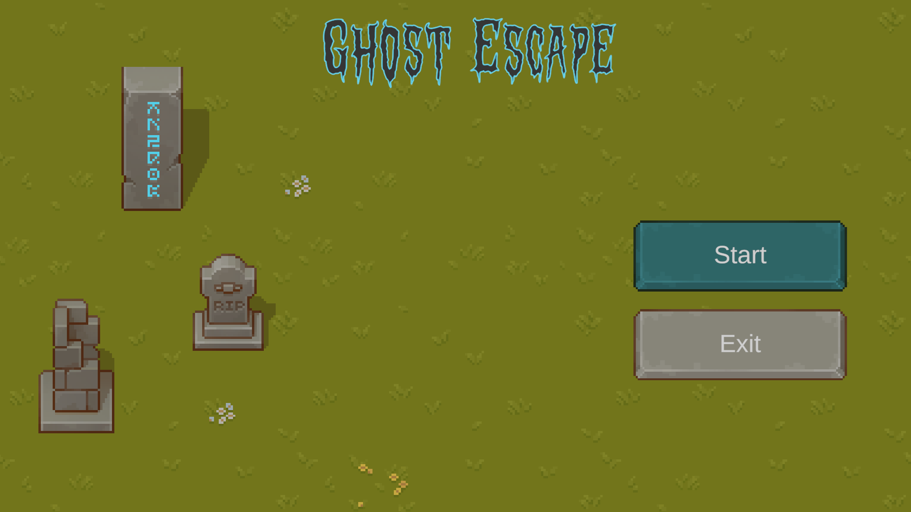
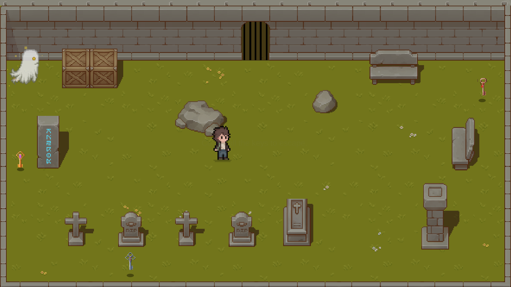
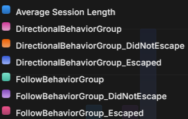

# Ghost Escape

This is a small Unity Game Project I made to understand the workings of the unity build system and setting up analytics to capture game data results for different ghost behavior

## Game Controls
* Movement
    * Keyboard (WASD)
    * Controller (Dpad or Left Stick)
    * Android (On screen Stick)
* Pick up Item
    * Keyboard (E)
    * Controller (South button)
    * Android (On Screen Button section)

## Goal of the game
You are trapped inside a graveyard with a ghost chasing you. Pick up all the keys in order to unlock the exit and escape.

## Project Goals
* Simple Game Loop
* Andriod Build
* x64 Build
* Two variations of ghost behavior for analytics testing
* Run Analytics and Send Data back to dashboard

## Analytics Information

### Information
When the game start the player is assigned randomly to either :
* DirectionBehaviorGroup (Ghost behavior is based on specific direction and faster speed)
* FollowBehaviorGroup (Ghost behavior is based on following the player at slower speed)
This Event is only sent once per game session. One session can have multiple rounds which will lengthen the session.

There are 4 more events either of which will be sent at the end of each round. With this information we can check group played more rounds and also the group by  how often each group achieved the win/lose state
* DirectionBehaviorGroup_Escaped
* DirectionBehaviorGroup_DidNotEscape
* FollowBehaviorGroup_Escaped
* FollowBehaviorGroup_DidNotEscape

Also added Metric for  Avg session length to see what other options were available.

### Legend

### Graph

## Challenges Faced
* Android build does not work exactly as expected. touch controls sometimes do not work and the viewport does not align with screen. 
* Analytics documentation is a bit scattered as there are newer versions.
* After the getting Analytics service set up, need more planning to set up and acquire more meaningful data.

